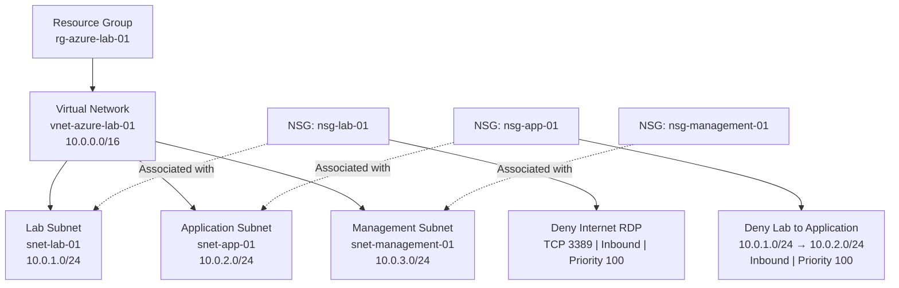

# Azure Lab — Network Architecture

**Status:** Designed and locally validated. Not yet deployed to Azure.

## Infrastructure Diagram

## Architecture Decisions

- **Resource Group:** Organizes all Azure resources belonging to the lab.
- **Virtual Network:** Uses the private address space `10.0.0.0/16`.
- **Lab Subnet:** Uses `10.0.1.0/24` for general lab resources.
- **Application Subnet:** Uses `10.0.2.0/24` for future application workloads.
- **Management Subnet:** Uses `10.0.3.0/24` for future management resources.
- **Network Security Groups:** Each subnet has a dedicated NSG, allowing independent security policies.

## Security Rules

| NSG | Rule | Priority | Action |
|---|---|---|---|
| nsg-lab-01 | Deny Internet RDP (TCP 3389) | 100 | Deny inbound |
| nsg-app-01 | Deny traffic from `10.0.1.0/24` to `10.0.2.0/24` | 100 | Deny inbound |
| nsg-management-01 | Azure default rules only | — | Default behavior |

The application NSG blocks traffic originating from the lab subnet. This is a first step toward network segmentation, not complete isolation.

Azure NSGs include default rules that permit communication within the same virtual network. Additional rules are required to restrict other traffic between the subnets.

## Validation

The Terraform configuration has successfully passed:

- `terraform init`
- `terraform fmt`
- `terraform validate -no-color`

The infrastructure has not yet been deployed or tested in Azure. No live connectivity or security testing has been performed.

## Planned Improvements

- Define explicit access policies between the lab, application and management subnets.
- Review management access and apply least-privilege network rules.
- Add monitoring and logging.
- Deploy and test the infrastructure after activating an Azure subscription.
