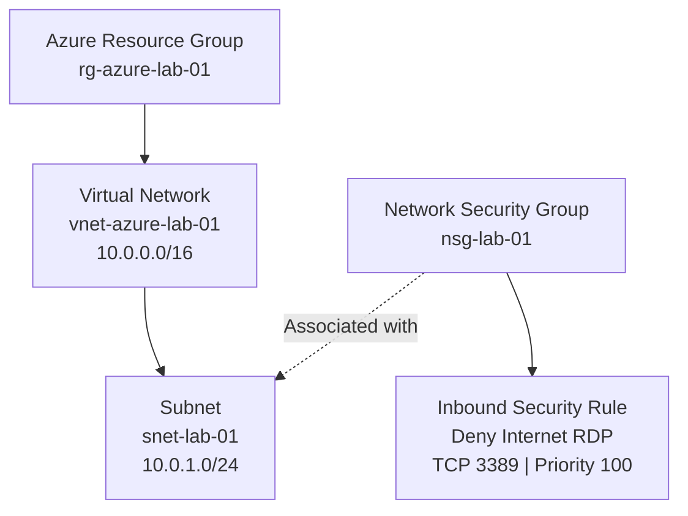

# Azure Lab — Network Architecture

**Status:** Designed and locally validated. Not yet deployed to Azure.

## Infrastructure Diagram

## Architecture Decisions

- **Resource Group:** Organizes all resources belonging to the lab.
- **Virtual Network:** Provides a private Azure network with address space `10.0.0.0/16`.
- **Subnet:** Reserves `10.0.1.0/24` for the initial lab resources.
- **Network Security Group:** Controls network traffic and is associated with the subnet.
- **RDP Security Rule:** Explicitly denies inbound TCP port 3389 traffic originating from the Internet.

## Validation

The Terraform configuration has successfully passed:

- `terraform init`
- `terraform fmt`
- `terraform validate`

The infrastructure has not yet been deployed or tested in Azure.
